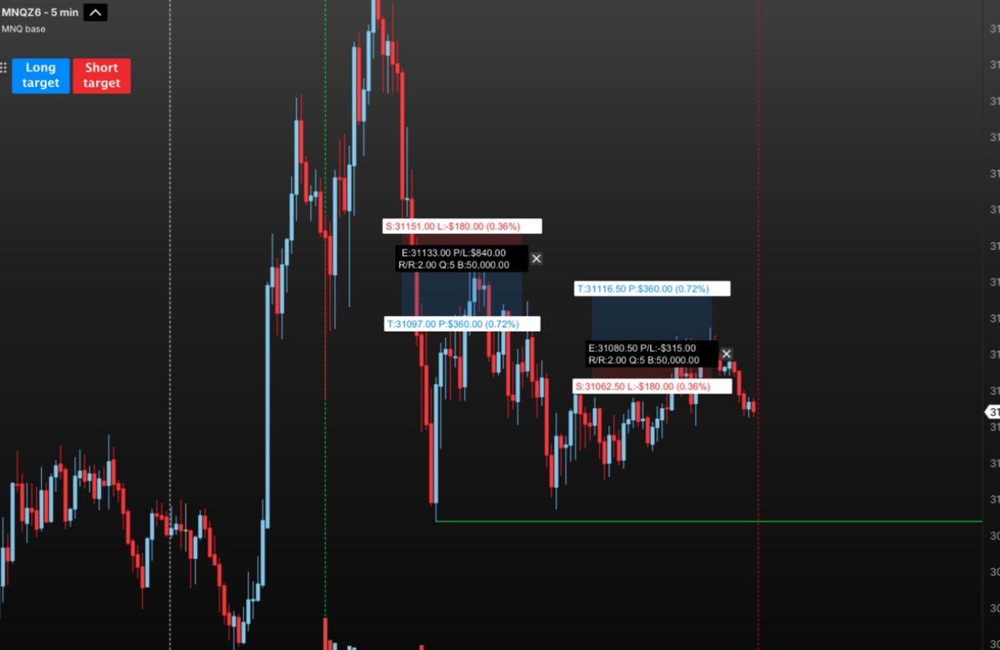
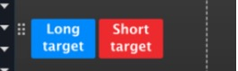
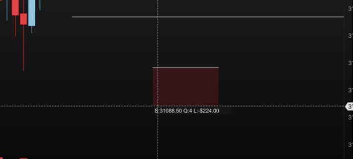
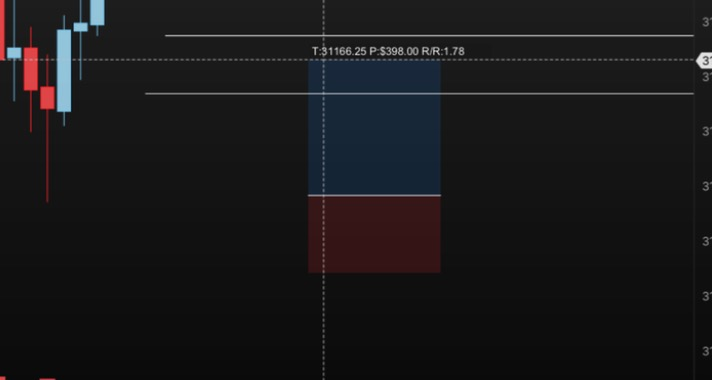
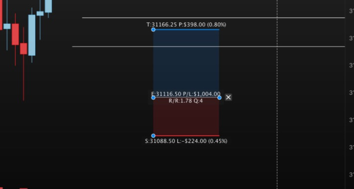
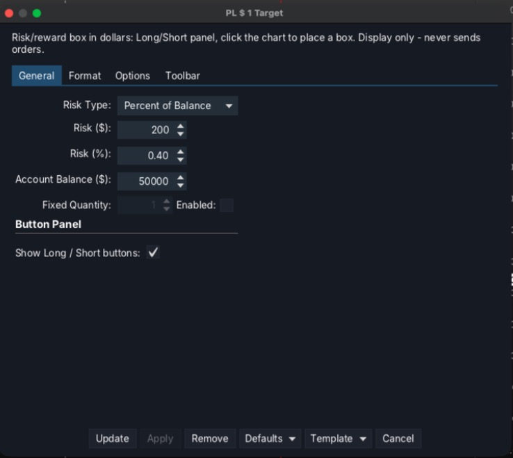
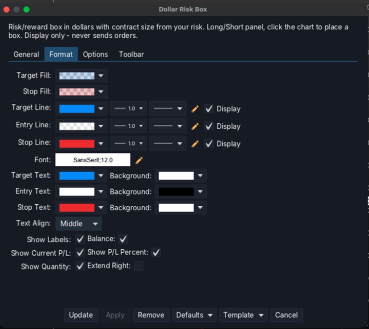

# Dollar Risk Box for MotiveWave

**English** | [Русский](README.ru.md)

[](LICENSE)


A risk/reward box for [MotiveWave](https://www.motivewave.com) that shows **money, not points** — and tells you **how many contracts** fit your risk.

MotiveWave's built-in *PL 1 Target* drawing tool labels profit and loss as *points × quantity*. This indicator looks and behaves like it, but every label is in **dollars**, and the quantity is **calculated from your risk** (a fixed $ amount or a % of your balance).



> **Display only.** The indicator is a plain MotiveWave *Study*. It has no access to the order API and **cannot place, modify or cancel orders**. It only draws and calculates.

## Features

- **Stop / Entry / Target box** in the style of the built-in tool, with labels:
  `S:` stop price, loss in $ and % of balance · `E:` entry price, current P/L in $, R/R, contracts `Q`, balance · `T:` target price, profit in $ and %.
- **Position size from risk.** Fixed $ risk *or* % of balance. Contracts = `floor(risk ÷ (stop distance × point value))`. Optional fixed quantity.
- **Labels that stay out of the way.** The upper label sits above the upper line and the lower one below the lower line, so the text lies on the plain chart, not on the candles inside the box. Plates are semi-transparent (*Label Opacity*) with white text.
- **Place a box with clicks.** Press **Long target** or **Short target**, then click the **entry**, the **stop** and the **target**. While you move the mouse a live label shows the **number of contracts and the $ loss** at the stop, and the **profit and R/R** at the target — you see the trade before you commit. Prefer speed? Switch to *1 click* and get a ready-made box. Place as many boxes as you like.
- **Delete a box with the Delete key.** Select a box and press **Delete** (or Backspace): only that box goes, the indicator and the other boxes stay. It acts only on a selected box under the mouse, so Delete on any other drawing still works as usual.
- **Made a mistake? Press Esc.** Everything you have placed so far disappears (pressing the lit button again does the same).
- **Compact boxes.** A new box is a few bars wide (setting *New Box Width*) instead of stretching across the chart.
- **Move the whole box** by grabbing it anywhere (fill or labels), like in TradingView. Drag the handles to change stop, target or width.
- **Draggable panel** — grab the `⠿` grip and put the panel wherever you like; the position is saved.
- Per-box **✕** button, right-click menu (delete, flip long/short, delete all).
- Colors, lines, font, text alignment and what to show are configurable on the *Format* tab.



## Install

1. Download `DollarRiskBox.jar` from the [latest release](../../releases/latest).
2. Put it into the **`MotiveWave Extensions`** folder in your user home folder (MotiveWave scans it automatically; on macOS: `~/MotiveWave Extensions` — create the folder if it does not exist).
3. Restart MotiveWave. The indicator appears under **Study → Alex Indicators → Dollar Risk Box**.

> The menu folder is called *Alex Indicators* (the author keeps all their MotiveWave indicators there). If you build from source, rename it with the `MENU_GENERAL` line in `dollar_risk_box/nls/strings.properties`.

Add it to a chart once — the **Long / Short** panel appears. Save the chart as a *Template* if you want the panel on every chart.

> Tested on macOS with MotiveWave 7.1.1 and CME futures (MNQ). The jar is plain Java and should work on Windows too, but that has not been tested.

## How to use

| You want to… | Do this |
|---|---|
| Plan a long (3 clicks) | Press **Long target**, click the **entry**, then the **stop** (below the entry), then the **target** (above it) |
| Plan a short (3 clicks) | Press **Short target**, click the **entry**, then the **stop** (above the entry), then the **target** (below it) |
| Cancel what you are placing | Press **Esc**, or press the lit button again |
| Move the whole box | Press and drag it anywhere inside (fill or label) |
| Change stop / target | Click the box once, drag the dot on the stop or target line |
| Change the width | Drag the dot at the right end of the entry line |
| Delete one box | Select it (click) and press **Delete**, or click its **✕**, or right-click it → *Delete this box* |
| Flip long ↔ short | Right-click the box → *Flip* |
| Move the panel | Drag the `⠿` grip |

### Placing a box

1. Press **Long target** (or **Short target**) — a hint under the panel tells you what to click next.
2. **Click the entry.** Move the mouse down (for a long): the red zone follows it, and the label shows the **quantity** and the **loss in $** for that stop.
3. **Click the stop.** Move the mouse up: the label now shows the **profit in $** and the **R/R** for that target.
4. **Click the target.** The box is placed.





A stop clicked on the wrong side of the entry (or a target on the wrong side) is not accepted — the hint says what is expected. **Esc** (or pressing the lit button again) cancels the box you are placing at any step.

If you prefer one click, set **New Box** to *1 click*: the click puts a ready-made box at that price — the stop one average-bar range from the entry and the target twice that (2R). Adjust it afterwards by dragging the handles.

### Settings



- **New Box** — *3 clicks* (entry, stop, target; the default) or *1 click* (a ready-made box at the clicked price).
- **New Box Width (bars)** — how wide a new box is, in bars on the screen (default 8). You can still stretch a box afterwards with the handle on the right end of the entry line.
- **Escape cancels a box being placed** — on by default.
- **Delete key removes the selected box (not the whole indicator)** — on by default. Switch it off and Delete goes back to the platform.
- **Risk Type** — *Fixed Amount* uses **Risk ($)**; *Percent of Balance* uses **Risk (%)** × **Account Balance**.
- **Account Balance** is typed in by hand. A MotiveWave indicator cannot read your broker account, so update it when your balance changes.
- **Fixed Quantity** — switch off the risk-based sizing and use a constant number of contracts.
- **Format → Label Opacity** — transparency of the label plates (default 70 %; lower = more see-through, the white text stays readable at any value).
- **Format → Balance** — also show your account balance on the entry label (off by default, to keep that label short).



### Example

MNQ, point value $2. Stop 46 points away → $92 risk per contract. With a $200 risk budget: `floor(200 / 92) = 2` contracts, maximum loss `2 × $92 = $184`.

### Protect the panel from accidental deletion

The boxes and the panel live inside one indicator. MotiveWave's trash icon (and *Delete* in the menu) removes the **whole indicator**, panel included. The **Delete key** no longer does that for a selected box (see above), but the trash icon still does. To prevent it, right-click the panel → **Lock Figure**. A locked indicator ignores the trash icon, while everything else keeps working. To remove it on purpose: *Unlock Figure*, then the trash icon.

## Build from source

Requirements: a JDK (17 or newer), `mwave_sdk.jar` and the JavaFX jars (`javafx.*.jar`) from your own MotiveWave installation — none of them is included in this repository. On macOS `build.sh` finds all of it inside `/Applications/MotiveWave.app` by itself.

```bash
bash build.sh            # builds build/DollarRiskBox.jar
bash build.sh install    # also copies it into ~/MotiveWave Extensions
```

Different locations: `MW_SDK=/path/to/mwave_sdk.jar MW_EXT=/path/to/extensions bash build.sh install`.
On Windows, compile by hand: `javac --release 21 -cp "mwave_sdk.jar;<folder with the JavaFX jars>\*" -d out dollar_risk_box/DollarRiskBox.java`, copy `dollar_risk_box/nls/strings.properties` to `out/dollar_risk_box/nls/`, then `jar cf DollarRiskBox.jar -C out .`.

You can check the "no orders" claim yourself: `javap -v` on the compiled classes shows no reference to `order_mgmt` or `OrderContext`.

## Changelog

**1.2.0**
- **Delete key** removes the selected box and leaves the indicator and the other boxes alone (setting *Delete key removes the selected box*).
- The menu folder is now **Study → Alex Indicators** (was *General*).

**1.1.0**
- Place a box with **3 clicks** (entry, stop, target) with a live preview of quantity, $ loss, profit and R/R; **1 click** is still available (setting *New Box*).
- **Esc** cancels the box you are placing.
- New boxes are **narrow** (default 8 bars, setting *New Box Width*) — the width is measured in bars on the screen, so it is the same at any place of the chart.

**1.0.1** — cleaner labels, *Label Opacity* setting, white text on a dark plate, a shorter entry label.

**1.0.0** — first release.

## Limitations

- The balance for % risk is entered manually (see above).
- Handles are drawn only while the indicator is selected (click a box) — a MotiveWave rule for indicators.
- All boxes belong to one indicator instance; deleting the indicator deletes them all (use *Lock Figure*).

## Disclaimer

This is an independent, community project. It is **not affiliated with, endorsed by or supported by MotiveWave**; "MotiveWave" and "PL 1 Target" belong to their respective owners. The indicator is a calculation aid, **not trading or financial advice**. Markets carry risk — verify every number yourself before you trade.

## License

[MIT](LICENSE) © 2026 Zen Trader
